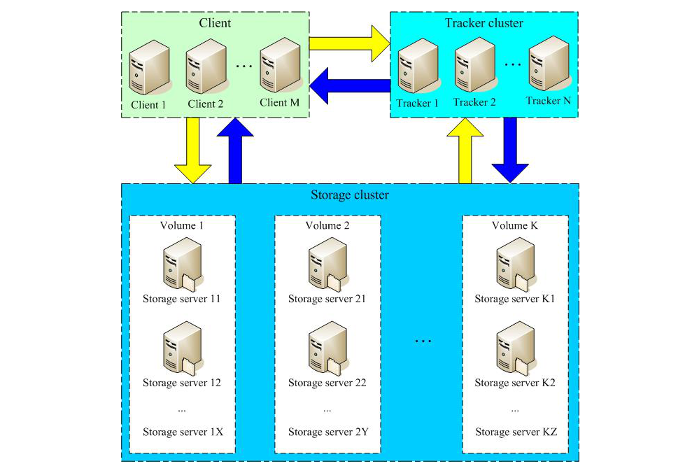
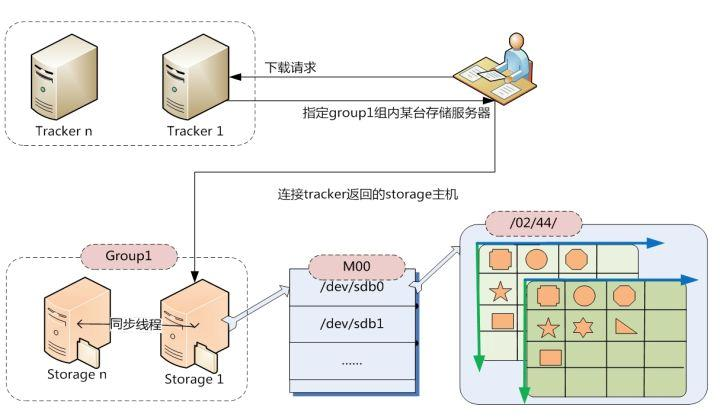
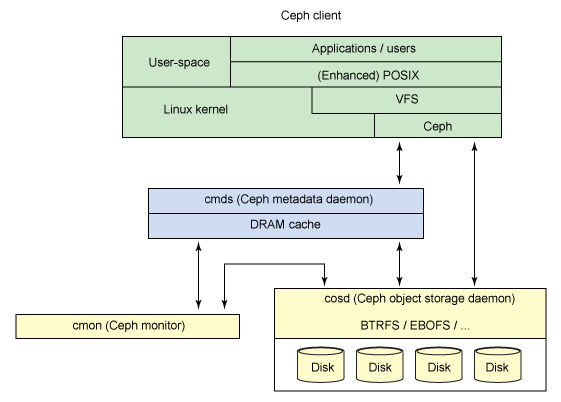
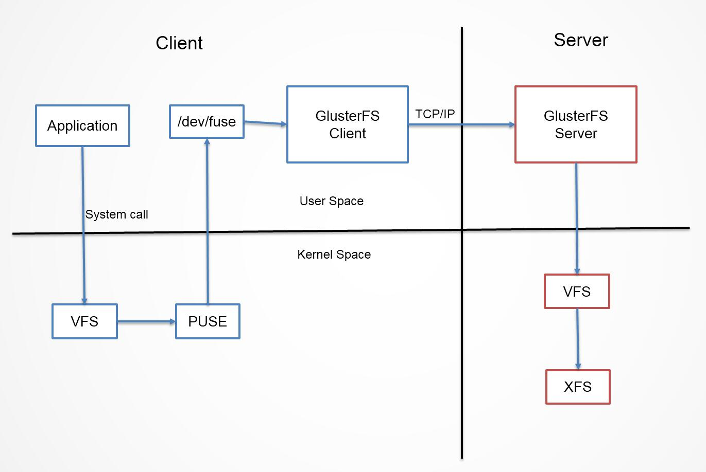

# 分布式文件系统调研报告

## 一、[项目目的](#1)

## 二、[项目背景](#2)
1. [时代背景](#21)
2. [分布式文件系统概念](#22)
3. [FastDFS简介](#23)
4. [FastDFS 的优点](#24)
5. [FastDFS中存在的问题](#25)

## 三、[立项依据](#3)
1. [FastDFS的中心化和静态负载均衡](#31)
2. [去中心化](#32)
3. [动态负载均衡](#33)

## 四、[前瞻性/重要性分析](#4)

## 五、[相关工作](#5)
1. [一些分布式文件系统](#51)

 
 
 
 
 
 
 
 
 
 
 

<h2 id="1"> 一、项目目标 </h2>

- FastDFS的去中心化和基于去中心化的FastDFS的动态负载均衡

<h2 id="2"> 二、项目背景 </h2>

<h3 id="21"> 1. 时代背景 </h3>

-  随着数据中心数据信息的增加和互联网应用的多样化，大量半结构化和非结构化数据涌现，大数据时代来临。在大数据分析和处理技术吸引了越来越多关注的同时，作为其底层支持的海量数据存储系统成为研究的热点。大数据时代的海量数据存储呈现出新的特点：1）数据规模不断扩大，文件数量急剧增长，一些大型的互联网公司如Google，腾讯等的数据规模已突破PB量级，需要管理的文件数达到亿级；2）访问并发度高。互联网信息服务通常面对大量的用户，同时在线人数也达数千万。大量的用户并发访问造成大量的随机读写，对存储系统的元数据性能和文件访问延迟带来很大的挑战；3）数据结构和处理需求呈现多样化，包括离线数据分析类应用和在线并发访问类应用，经常需要24h不间断服务，对系统的可靠性要求越来越高。[1]
-  在这种背景下，人们对分布式文件系统的研究也越来越深入，目前为止已经出现了一批以Linux为基础的分布式文件系统，以支持高可靠、高性能、高并发的应用需求。

<h3 id="22"> 2. 分布式文件系统概念 </h3>

- 相对于本机端的文件系统而言,分布式文件系统(Distributed File System，DFS)是一种允许文件通过网络在多台主机上分享的文件系统。在这样的文件系统中,客户端并非直接访问底层的数据存储区块,而是通过网络,以特定的通信协议和服务器沟通。借由通信协议的设计,可以让客户端和服务器端都能根据访问控制清单或是授权,来限制对于文件系统的访问。相对地,在一个分享的磁盘文件系统中,所有节点对数据存储区块都有相同的访问权,在这样的系统中,访问权限就必须由客户端程序来控制。

<h3 id="23"> 3. FastDFS简介 </h3>

- FastDFS是一款开源的、分布式文件系统(Distributed File System)，由淘宝开发平台部资深架构师余庆开发。FastDFS由纯 C 实现,支持 Linux、 FreeBSD 等 UNIX 类 GoogleFS, 提供了 C、 Java 和 PHP API 为互联网应用量身定做。作为一个分布式文件系统，它对文件进行管理，功能包括:文件存储、文件同步、文件访问(文件上传、文件下载)等，解决了大容量存储和负载均衡的问题，特别适合中小文件(建议范围:4KB < file_size <500MB)，对以文件为载体的在线服务，如相册网站、视频网站等等具有显著的效果。

图一:FastDFS架构

- FastDFS的架构设计: 由client、storage server、tracker 三部分组成
    - Storage server:
        - Storage server以组(卷,group或volume)为单位组织,一个group内包含多台storage机器,数据互为备份,存储空间以group内容量最小的storage为准,所以建议group内的多个storage尽量配置相同,以免造成存储空间的浪费。
        - 以group为单位组织存储能方便的进行应用隔离、负载均衡、副本数定制(group内storage server数量即为该group的副本数,(即负载是静态的)),比如将不同应用数据存到不同的group就能隔离应用数据,同时还可根据应用的访问特性来将应用分配到不同的group来做负载均衡;缺点是group的容量受单机存储容量的限制,同时当group内有机器坏掉时,数据恢复只能依赖group内地其他机器,使得恢复时间会很长。
        - group内每个storage的存储依赖于本地文件系统,storage可配置多个数据存储目录,比如有10块磁盘,分别挂载在/data/disk1-/data/disk10,则可将这10个目录都配置为storage的数据存储目录。
        - storage接受到写文件请求时,会根据配置好的规则,选择其中一个存储目录来存储文件。为了避免单个目录下的文件数太多,在storage第一次启动时,会在每个数据存储目录里创建2级子目录,每级256个,总共65536个文件,新写的文件会以hash的方式被路由到其中某个子目录下,然后将文件数据直接作为一个本地文件存储到该目录中。
    - Tracker Server:
        - 跟踪服务器,主要做调度工作,起负载均衡的作用。在内存中记录集群中所有存储组和存储服务器的状态信息,是客户端和数据服务器交互的枢纽。Tracker 是 FastDFS 的协调者,负责管理所有的 storage server 和 group,每个 storage在启动后会连接 Tracker,告知自己所属的 group 等信息,并保持周期性的心跳, tracker根据 storage 的信息,建立 group==>[storage server list]的映射表。
        - Tracker 需要管理的元信息很少,会全部存储在内存中;另外 tracker 上的元信息都是由 storage 汇报的信息生成的,本身不需要持久化任何数据,这样使得 tracker非常容易扩展,直接增加 tracker 机器即可扩展为 tracker cluster 来服务,cluster 里每个tracker 之间是完全对等的,所有的 tracker 都接受 stroage 的信息,生成元数据信息来提供读写服务。
    - Client:
        - 客户端,作为业务请求的发起方,通过专有接口,使用 TCP/IP 协议与跟踪器服务器或存储节点进行数据交互。FastDFS 向使用者提供基本文件访问接口,比如 upload、download、append、delete 等,以客户端库的方式提供给用户使用。

图二：FastDFS数据传输流程

- FastDFS的文件同步
    - 写文件时,客户端将文件写至group内一个storage server即认为写文件成功,storage server写完文件后,会由后台线程将文件同步至同group内其他的storage server。
    - 每个storage写文件后,同时会写一份binlog,binlog里不包含文件数据,只包含文件名等元信息,这份binlog用于后台同步,storage会记录向group内其他storage同步的进度,以便重启后能接上次的进度继续同步;进度以时间戳的方式进行记录,所以最好能保证集群内所有server的时钟保持同步。
    - storage的同步进度会作为元数据的一部分汇报到tracker上,tracke在选择读storage的时候会以同步进度作为参考。
    - 比如一个group内有A、B、C三个storage server,A向C同步到进度为T1 (T1以前写的文件都已经同步到B上了),B向C同步到时间戳为T2(T2 > T1),tracker接收到这些同步进度信息时,就会进行整理,将最小的那个做为C的同步时间戳,本例中T1即为C的同步时间戳为T1(即所有T1以前写的数据都已经同步到C上了);同理,根据上述规则,tracker会为A、B生成一个同步时间戳。

<h3 id="24"> 4. FastDFS 的优点 </h3>

- 对机器的配置要求低
    - FastDFS无论是上传下载还是同步恢复,对机器的配置要求都是非常低的,这就使得使用FastDFS来提供分布式文件存储的成本很低。
- 上传速度快
    - 由于使用的是弱一致性模型,上传后不需要强写副本再返回,故上传速度相对于采用强一致性模型的分布式文件系统要快得多。
- 高可靠性
    - FastDFS作为分布式文件系统,其冗余为文件系统提供了极高的可靠度,即使有单个存储节点故障,整个系统仍能正常工作,并对故障节点的数据进行恢复。
- 应用场景
    - FastDFS是为互联网应用量身定做的一套分布式文件存储系统，非常适合用来存储用户图片、视频、文档等文件。对于互联网应用，和其他分布式文件系统相比，优势非常明显。
- 用户量
    - 截止2012年底至少有25家公司在使用FastDFS，其中有好几家是做网盘的公司。其中存储量最大的一家，集群中存储group数有400个，存储服务器超过800台，存储容量达到6PB，文件数超过1亿。以下是部分使用Fast DFS的用户列表[2]：
        - 支付宝（http://www.alipay.com/）
        - 京东商城（http://www.360buy.com/）
        - 淘淘搜（http://www.taotaosou.com/）
        - 赶集网（http://www.ganji.com/）
        - 淘米网（http://www.61.com/）
        - 迅雷（http://www.xunlei.com/）
        - 蚂蜂窝（http://www.mafengwo.cn/）
- 易于修改
    - FastDFS由纯C语言实现，在阅读其源码时，在语言层面上不存在太大的障碍。相比于其他分布式文件系统，其5.2万行的代码量减轻了在阅读源码时的负担

<h3 id="25"> 5. FastDFS中存在的问题 </h3>

- 中心化架构带来的单点故障和扩展性问题
- 静态负载均衡带来的性能问题
- 不支持断点续传，对大文件将是噩梦(FastDFS不适合大文件存储)
- 不支持POSIX通用接口访问，通用性较低
- 对跨公网的文件同步，存在较大延迟，需要应用做相应的容错策略
- 同步机制不支持文件正确性校验，降低了系统的可用性
- 通过API下载，存在单点的性能瓶颈

<h2 id="3"> 三、立项依据 </h2>

<h3 id="31"> 1. FastDFS的中心化和静态负载均衡 </h3>

- 中心化
    - 从FastDFS的架构中可以看出，FastDFS是一个中心化的分布式文件系统。中心节点即为Tracker Server, 用户与存储节点之间的通信需要经过tracker的调度。一旦中心节点Tracker Server发生故障，即所谓单点故障的问题，那么整个系统将无法正常运行。
    - FastDFS可以通过增加冗余的tracker server解决单点故障的问题，但是多个tracker server就意味着storage server需要同时向每个tracker server报告自身的磁盘剩余空间、文件同步状况、文件上传下载次数等状态信息；而这些任务的完成就要求每个storage server都要在后台运行着一个单独的线程来完成对tracker server的连接和定时报告。这种机制必定意味着资源的浪费。
    - 中心化带来的另一个较大的问题是扩展性较低，由于中心节点承担的是维护整个系统和数据请求调度的任务，当节点增多时会给中心节点带来较大的负担，同时也会影响性能。
- 静态负载均衡
    - FastDFS现有的负载均衡算法属于静态负载算法，该算法为每个存储组定义了一个评价值Vi，Vi的计算方法是：Vi = Vi0 + Ti / Tmax (Vi0是上一层该组的Vi值，Ti为该组内各storage server的存储空间之和，Tmax是所有组中Ti的最大值)。Tracker server在选择存储组的时，总是选择Vi最高的两个存储组。而Vi显然与该存储组当前的空间利用率、性能、连接数无关，这就意味着总存储空间大但是当前负载很重，连接数很大的storage server可能被选中。
    - 随着互联网的蓬勃发展，需要的存储空间越来越多，并发量越来越大，FastDFS原有的静态负载均衡策略难以适应高并发下的线性扩容。目前的FastDFS发布的各个版本的负载均衡策略，均采用的是静态的负载均衡策略，在扩容时会因为没有考虑节点的实时负载，使存储服务器在一段时间内出现负载倾斜的情况，为了适应数据量急剧增加的互联网应用，寻找更适合的负载均衡策略迫在眉睫。
- 相对于FastDFS的其他问题，中心化架构和静态负载均衡带来的问题是系统层面上的缺陷。而且这两个问题普遍存在于分布式文件系统中，故解决这两个问题更有意义。
- 基于此，我们小组提出了FastDFS的去中心化和基于去中心化的FastDFS的动态负载均衡。

<h3 id="32"> 2. 去中心化 </h3>

- 在目前的分布式文件系统中，主要采用DHT技术的思想实现去中心化。
- DHT技术：
    - DHT全称叫分布式哈希表(Distributed Hash Table)，是一种分布式存储方法。它提供的服务类似于hash表，键值对存储在DHT中，任何参与该结构的节点能高效的由键查询到数据值。这种键值对的匹配是分布式的分配到各个节点的，这样节点的增加与删减只会带来比较小的系统扰动。这样也可以有效地避免“中央集权式”的服务器（比如：tracker）的单一故障而带来的整个网络瘫痪。
    - DHT技术本质上强调以下特性：
        - 离散性：构成系统的节点并没有任何中央式的协调机制。
        - 伸缩性：即使有成千上万个节点，系统仍然应该十分有效率。
        - 容错性：即使节点不断地加入、离开或是停止工作，系统仍然必须达到一定的可靠度。
    - 其关键技术为：任一个节点只需要与系统中的部分节点（通常为O(logN)个）沟通，当成员改变的时候，只有一部分的工作（例如数据或键的发送，哈希表的改变等）必须要完成。基本上，DHT技术就是一种映射key和节点的算法以及路由的算法。
    - DHT的结构：关键值空间分区(keyspace partitioning)和延展网络(overlay network)
        - 关键值空间分区是指每一个节点掌管部分键空间。
        - 延展网络是指一个连接各个节点的抽象网络，它能使每个节点找到拥有特定键的节点。每个节点或者存储了该键，或者储存有离这个键更近（这个距离由具体算法定义）的节点链接。
    - 当这些组件都准备好后,一般使用分布式散列表来存储与读取的方式如下所述。假设关键值空间是一个 160 位长的字符串集合。为了在分布式散列表中存储一个文件,名称为filename 且内容 data,我们计算 filename 的 SHA1 散列值（一个 160 位的关键值k）并将消息 put(k,data)送给分布式散列表中的任意参与节点。此消息在延展网络中被转送,直到抵达在关键值空间分区中被指定负责存储关键值 k 的节点。而 (k,data)即存储在该节点。其他的节点只需要重新计算 filename 的散列值 k,然后提交消息 get(k)给分布式散列表中的任意参与节点,以此来找与 k 相关的数据。此消息也会在延展网络中被转送到负责存储 k 的节点, 而此节点则会负责传回存储的数据 data。
    - 实现DHT的一些要求:
        - 平衡性：平衡性是指哈希的结果能够尽可能分布到所有的缓冲中去,这样可以使得所有的缓冲空间都得到利用。很多哈希算法都能够满足这一条件。
        - 单调性：单调性是指如果已经有一些内容通过哈希分派到了相应的缓冲中,又有新的缓冲加入到系统中。哈希的结果应能够保证原有已分配的内容可以被映射到原有的或者新的缓冲中去,而不会被映射到旧的缓冲集合中的其他缓冲区。
        - 分散性：在分布式环境中,终端有可能看不到所有的缓冲,而是只能看到其中的一部分。当终端希望通过哈希过程将内容映射到缓冲上时,由于不同终端所见的缓冲范围有可能不同,从而导致哈希的结果不一致,最终的结果是相同的内容被不同的终端映射到不同的缓冲区中。这种情况显然是应该避免的,因为它导致相同内容被存储到不同缓冲中去,降低了系统存储的效率。分散性的定义就是上述情况发生的严重程度。好的哈希算法应能够尽量避免不一致的情况发生,也就是尽量降低分散性。
        - 负载：负载问题实际上是从另一个角度看待分散性问题。既然不同的终端可能将相同的内容映射到不同的缓冲区中,那么对于一个特定的缓冲区而言,也可能被不同的用户映射为不同 的内容。与分散性一样,这种情况也是应当避免的,因此好的哈希算法应能够尽量降低缓冲的负荷。
        - 平滑性：平滑性是指缓存服务器的数目平滑改变和缓存对象的平滑改变是一致的。
    - DHT实现算法有Chord, Pastry, Kademlia等。

<h3 id="33"> 3. 基于去中心化系统的动态负载均衡 </h3>

- 在去中心化系统中，通常使用的是结构化的P2P系统，其通常使用分布式哈希表（DHT）技术，如Chord、Kademlia等。
- 在结构化P2P协议中，各结点通过承载一定的键值空间来分担网络负载。在理想情况下，各节点的文件资源均匀分布，各结点负载均匀分布，系统具有良好的负载均衡并能发挥最优性能。然而在实际网络中，事实并非如此，基于DHT算法的P2P系统存在严重的负载不平衡。引起负载不平衡主要有以下原因[3]：
    1. 各结点承载的键值空间相差很大。在大规模的结构化P2P系统中，基于DHT算法生成结点ID的方法使结点承载的最大键值空间是最小键值空间的O(logN)倍，例如Chord，Pastry等P2P协议。
    2. 各个节点的存储空间、带宽等方面不同，当一个比较大的键值空间被分配到一个性能比较低的节点时，会带来很大的负载不平衡。
    3. 各结点承载的文件数目相差较大。即使各结点承载的键值空间相同，各结点负载也不一定均匀。在具有n个结点和n个键值的情况下，将有Θ(logN/loglogN)个键值以很高的概率被分配到同一个结点上。
    4. 用户查询具有不平衡性。目前提出的结构化P2P模型均假设用户查询随机而均匀。然而P2P系统中的查询请求分布和HTTP请求分布具有很大的相似性，均服从Zipf分布定律。各关键字查询的概率存在数量级差异，承载热点文件的结点负载将远大于其他结点。这就导致有部分节点的负载会远远高于其他节点，导致整个系统的资源利用率不高。
- 在P2P网络中进行负载均衡的一些技术：
    - 动态副本法：主要针对由于资源访问热度不均而引起的网络负载不均问题。算法的核心思想是通过增加“热”文件副本数量，将客户端连接分散到多个节点中，实现  “热”点降温。不同动态副本算法之间的主要区别在于如何选择副本放置节点。[4]
    - 虚拟节点算法：主要针对因服务器配置不同而引起的存储负载不均问题。设计思想是通过虚拟节点而不是实际物理节点进行数据的储存和路由路径上的文件查询转发。算法将配置不同的服务器虚拟成配置一致的虚拟节点，并随机分布在哈希环上。每一个实际的服务器负责多个虚拟节点。当有节点负载过重时，将负载过重的物理节点的虚拟节点迁移到负载较轻的物理节点上。[5]
    - 动态路由表：针对资源查找路由产生的负载。在P2P系统中，拥有热点文件的节点会承担大量的文件查询请求，以及查询路由路径上的节点也会承担相应的请求消息路由负载。[6]

<h2 id="4"> 四、前瞻性/重要性分析 </h2>

- 在长远的发展来看，文件系统使用的集群会变得非常庞大，这个集群它不再是某个大型数据中心，也可能会是很多个数据中心的集合体，而这些数据中心也会分布在不同的区域范围内。未来集群不能再是外部数据中心那么简单唯一，甚至最终有可能的是通过互联网来建立“唯一”的一个集群。而当下使用一台服务器是不行的，会阻碍发展的需求。如果集群的范围变小，结果将会是集群特别不稳定，影响用户对数据的需求，遏制了集群的快速发展。所以分布式文件系统的发展前景很广阔。在大规模使用分布式文件系统后，它的安全性、性能等因素将会是研究的重点。故我们对以FastDFS为代表的分布式文件系统的负载均衡和去中心化研究很有意义。

<h2 id="5"> 五、相关工作 </h2>

<h3 id="51"> 一些分布式文件系统 </h3>

- ceph：
    - Ceph分布数据的过程：首先计算数据x的Hash值并将结果和PG（分区）数目取余，以得到数据x对应的PG编号。然后，通过CRUSH算法将PG映射到一组OSD中。最后把数据x存放到PG对应的OSD中。这个过程中包含了两次映射，第一次是数据x到PG的映射。如果把PG当作存储节点，那么这和文章开头提到的普通Hash算法一样。不同的是，PG是抽象的存储节点，它不会随着物理节点的加入或则离开而增加或减少，因此数据到PG的映射是稳定的。
    - Ceph文件系统拥有优秀的性能、高可靠性和高可扩展性这三大特性。优秀的性能是指数据能够在各个节点上进行均衡地分布；高可靠性表示在Ceph文件系统中没有单点故障，并且存储在系统中的数据能够保证尽可能的不丢失；高可扩展性即Ceph系统易于扩展，能够很容易实现从TB到PB级别的扩展。

图三：简单的 Ceph 生态系统

- glusterfs：
    - GlusterFS采用独特的无中心对称式架构，与其他有中心的分布式文件系统相比，它没有专用的元数据服务集群。在文件定位的问题上，GlusterFS使用DHT算法进行文件定位，集群中的任何服务器和客户端只需根据路径和文件名就可以对数据进行定位和读写访问。换句话说，GlusterFS不需要将元数据与数据进行分离，因为文件定位可独立并行化进行。
    - 数据访问流程：
        1. 使用Davies-Meyer算法计算32位hash值，输入参数为文件名
        2. 根据hash值在集群中选择子卷（存储服务器），进行文件定位
        3. 对所选择的子卷进行数据访问。
    - 存在的问题：GlusterFS目前主要适用大文件存储场景，对于小文件尤其是海量小文件，存储效率和访问性能都表现不佳。
    - 优势：使用弹性哈希算法，从而获得了接近线性的高扩展性，同时也提高了系统性能和可靠性。

图四：glusterfs客户端访问流程

- FastDHT
    - FastDHT 是一个高性能的分布式哈希系统 (DHT) ,使用 Berkeley DB 做数据存储,使用libevent做网络IO处理,提供 Java 版的客户端接口包｡适合用来存储用户在线､会话等小数据量信息｡
    - FastDHT存储Key Value Pair支持两种存储方式:缓存方式的MPOOL和持久存储方式的BDB｡Key包括三部分:Namespace,ObjectID和Key｡ Key可设置过期时间,自动清除过期数据。Server端划分group,同group数据互相备份,并且可自动压缩binlog.服务端可使用单线程,多线程模式｡
    - FastDHT一些特性:
        - 虚拟farm,便于扩容;
        - 分布式算法client端实现,不需要中心服务器;
        - 二进制通信协议,支持Proxy;
        - 使用libevent,异步IO方式,支持大并发;
        - 自动failover;
        - 支持长连接｡     
    - FastDHT集群由一个或多个组(group)组成,每个组由一台或多台服务器组成,同组服务器上存储的数据是相同的,数据同步只在同组的服务器之间进行｡组内各个服务器是对等的,对数据进行存取时,可以根据key的hash值来决定使用哪台服务器｡数据同步采用推(Push)的方式,由源服务器主动将数据同步到本组的其他服务器｡FastDHT集群由一个或多个组(group)组成,每个组由一台或多台服务器组成,同组服务器上存储的数据是相同的,数据同步只在同组的服务器之间进行｡组内各个服务器是对等的,对数据进行存取时,可以根据key的hash值来决定使用哪台服务器｡数据同步采用推(Push)的方式,由源服务器主动将数据同步到本组的其他服务器。

- Lustre：    
    - Lustre分布式文件系统是1999年卡内基梅隆大学的Peter J.Braam所发起的研究项目，Lustre是典型的元数据中心式的分布式文件系统，MDS（元数据服务器集群）用于存储文件的元数据信息，OSS（对象存储服务器）用于存储实际的文件数据。
    - Luster支持文件整体存储和文件分片两种存储方式。整体存储就是将文件整体存储在OST（对象存储目的地）中；而分片存储就是将文件分块存储在子目录Stripe下，Stripe有size（文件分片大小），ost（起始存储位置），和count（分片数量）三个参数。
    - Lustre的优点是可以设置具体子目录Stripe的参数，从而灵活的存储不同大小的文件，相比于单一的整体存储方式更为高效。但是Lustre不提供数据保护，也存在着元数据存储上单点问题，这两点决定了Lustre在安全性和容错性上的短板。

- HDFS（Hadoop Distributed File System）
    - HDFS是为Hadoop架构所设计的分布可扩展轻量级分布式文件系统，其由负责元数据存储的Namenode和负责存储实际数据的Datanodes组成。Namenode是一个中心服务器，负责管理文件系统的名称空间、文件数据快的组织以及客户端对数据的访问；而Datanodes就是一个个存储实际数据的节点。
    - HDFS只支持文件的分块存储，其将每个文件默认分为若干个64MB的数据块，集中存储在一个Datanode上。在存储某个文件的时，HDFS会为其创建另一个Datanode以存储其副本，从而在一定程度上保证了数据的安全性。
    - HDFS本身在性能等方面没有很大的优势，其优势在于以其为基础的一系列衍生架构，配合其衍生架构，大多数人将其用于数据挖掘数据分析等领域。

- GFS（Google File System）
    - GFS是Google公司为了存储海量搜索数据而设计的专用文件系统，其最为鲜明的特点是独特的容错机制以及自动负载均衡技术。GFS系统中包括一个独立的GFS Master控制服务器，多台GFS Chunkserver数据块服务器以及多个GFS Client客户端。
    - 和HDFS一样，上传到GFS中的文件都被分割成固定大小的Chunk，每一个Chunk在不同的Chunkserver中保存多份。Chunk数据块用以存储Chunk数据，并根据指定的Chunk标识符和字节范围来读写块数据。  
    - GFS Master存储Chunk的元数据，接受来自各个Chunkserver的周期性信息，并向各个Chunkserver发送指令
    - 在GFS中，GFS服务器生成诊断日志用于记录许多关键事件（如Chunkserver的启动和关闭）以及所有的远程调用的请求和相应。在空间允许的情况下，GFS会尽量保存这些日志。在系统发生故障后，通过对远程调用日志的分析，可以重建交互历史从而诊断出错误。

 
 

<h2 id="6"> 参考文献 </h2>

[1]: 周江，王伟平，孟丹，马灿，古晓艳，蒋杰 *面向大数据分析的分布式文件系统关键技术*  2014

[2]: 余庆 *分布式文件系统FastDFS架构解析.互联网架构*  2010,11:63-65

[3]: 熊伟，谢冬青，焦炳旺，刘洁 *一种结构化 P2P 协议中的自适应负载均衡方法* Journal of Software, Vol.20, No.3, March 2009, pp.660−670

[4]: 田浪军，陈卫卫，陈卫东，李涛 *云存储系统中动态负载均衡算法研究*    中国人民解放军理工大学指挥信息系统学院,国防科学技术大学 2013

[5]: Rao A., Lakshminarayanan K., Surana S., Karp R., Stoica I. (2003) *Load Balancing in Structured P2P Systems*. In: Kaashoek M.F., Stoica I. (eds) Peer-to-Peer Systems II. IPTPS 2003. Lecture Notes in Computer Science, vol 2735. Springer, Berlin, Heidelberg

[6]: 肖斐,邓亚平 *一种结构化P2P负载均衡策略的研究*  重庆邮电大学 2009

[7]: 刘胜利 *去中心化的安全分布式文件系统*  上海交通大学计算机科学与工程系 2012

[8]: 信俊昌 *去中心化的分布式存储模型*  东北大学计算机科学与工程学院 2017

[9]: 熊建波 *Fast DFS分布式文件系统负载均衡算法的改进研究* 武汉理工大学

[10]: 周子涵 *基于FastDFS的目录文件系统的研究与实现* 电子科技大学

[11]: 李长平 *基于FastDFS架构的小文件存储系统的设计与实现* 哈尔滨工业大学

[12]: 曾致远 *FastDFS负载均衡算法的改进及其在水土保持网站系统的应用* 华中科技大学

[13]: 张聪萍，尹建伟 *分布式文件系统的动态负载均衡算法*  浙江大学

