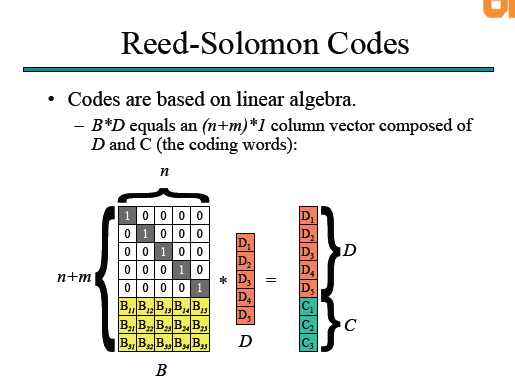
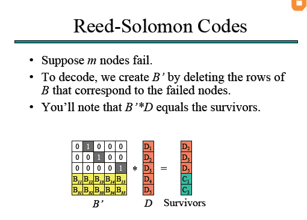
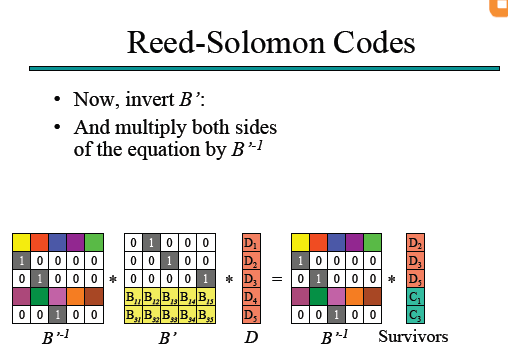
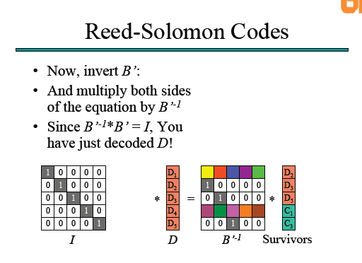

# 可行性报告
## 一、项目概述
## 二、理论依据
1. 去中心化的架构
2. 文件下载
3. 文件备份
## 三、技术依据
1. DHT网络的实现算法
2. BitTorrent协议的实现
3. Erasure code的具体实现
## 四、创新点
 
 
 
 
 
 
 
 
 
 
 
 
 
 

## 一、项目概述
- 构建一个校园规模的分布式文件共享系统。该文件系统利用DHT网络进行文件定位，利用bt协议进行文件下载，用EC纠删码进行文件备份。

## 二、理论依据
### 1. 去中心化的架构
1. DHT网络
- DHT全称叫分布式哈希表(Distributed Hash Table)，是一种分布式存储方法。它提供的服务类似于hash表，键值对存储在DHT中，任何参与该结构的节点能高效的由键查询到数据值。这种键值对的匹配是分布式的分配到各个节点的，这样节点的增加与删减只会带来比较小的系统扰动。这样也可以有效地避免“中央集权式”的服务器（比如：tracker）的单一故障而带来的整个网络瘫痪。
- DHT技术本质上强调以下特性：
    - 离散性：构成系统的节点并没有任何中央式的协调机制。
    - 伸缩性：即使有成千上万个节点，系统仍然应该十分有效率。
    - 容错性：即使节点不断地加入、离开或是停止工作，系统仍然必须达到一定的可靠度。
- 其关键技术为：任一个节点只需要与系统中的部分节点（通常为O(logN)个）沟通，当成员改变的时候，只有一部分的工作（例如数据或键的发送，哈希表的改变等）必须要完成。基本上，DHT技术就是一种映射key和节点的算法以及路由的算法。
- DHT的结构：关键值空间分区(keyspace partitioning)和延展网络(overlay network)
    - 关键值空间分区是指每一个节点掌管部分键空间。
    - 延展网络是指一个连接各个节点的抽象网络，它能使每个节点找到拥有特定键的节点。每个节点或者存储了该键，或者储存有离这个键更近（这个距离由具体算法定义）的节点链接。
- 当这些组件都准备好后,一般使用分布式散列表来存储与读取的方式如下所述。假设关键值空间是一个 160 位长的字符串集合。为了在分布式散列表中存储一个文件,名称为filename 且内容 data,我们计算 filename 的 SHA1 散列值（一个 160 位的关键值k）并将消息 put(k,data)送给分布式散列表中的任意参与节点。此消息在延展网络中被转送,直到抵达在关键值空间分区中被指定负责存储关键值 k 的节点。而 (k,data)即存储在该节点。其他的节点只需要重新计算 filename 的散列值 k,然后提交消息 get(k)给分布式散列表中的任意参与节点,以此来找与 k 相关的数据。此消息也会在延展网络中被转送到负责存储 k 的节点, 而此节点则会负责传回存储的数据 data。

2. 区块链
- 区块链（blockchain 或 block chain）是用分布式数据库识别、传播和记载信息的智能化对等网络，也称为价值互联网。中本聪在2008年，于《比特币白皮书》中提出“区块链”概念，并在2009年创立了比特币社会网络（Bitcoin network），开发出第一个区块，即“创世区块”。
- 区块链目的是存储不断增长的记录清单，而不会篡改和修改。

3. 为何选择DHT网络
- 相比区块链，DHT网络注重的是文件的分发问题，这更符合分布式文件系统的特性。而区块链虽然也是去中心化的架构，但其更注重于数据的不可篡改。

### 2. 文件下载
1. BitTorrent
- BitTorrent是由布莱姆·科恩设计的一个点对点（P2P）文件共享协议，此协议使多个客户端通过不可信任的网络的文件传输变得更容易。 
- 根据BitTorrent协议，文件发布者会根据要发布的文件生成提供一个.torrent文件，即种子文件，也简称为“种子”。
- 种子文件本质上是文本文件，包含Tracker信息和文件信息两部分。Tracker信息主要是BT下载中需要用到的Tracker服务器的地址和针对Tracker服务器的设置，文件信息是根据对目标文件的计算生成的，计算结果根据BitTorrent协议内的Bencode规则进行编码。它的主要原理是需要把提供下载的文件虚拟分成大小相等的块，块大小必须为2k的整数次方（由于是虚拟分块，硬盘上并不产生各个块文件），并把每个块的索引信息和Hash验证码写入种子文件中；所以，种子文件就是被下载文件的“索引”。
- 下载者要下载文件内容，需要先得到相应的种子文件，然后使用BT客户端软件进行下载。
- 下载时，BT客户端首先解析种子文件得到Tracker地址，然后连接Tracker服务器。Tracker服务器回应下载者的请求，提供下载者其他下载者（包括发布者）的IP。下载者再连接其他下载者，根据种子文件，两者分别告知对方自己已经有的块，然后交换对方所没有的数据。此时不需要其他服务器参与，分散了单个线路上的数据流量，因此减轻了服务器负担。
- 下载者每得到一个块，需要算出下载块的Hash验证码与种子文件中的对比，如果一样则说明块正确，不一样则需要重新下载这个块。这种规定是为了解决下载内容准确性的问题。
- 一般的HTTP/FTP下载，发布文件仅在某个或某几个服务器，下载的人太多，服务器的带宽很易不胜负荷，变得很慢。而BitTorrent协议下载的特点是，下载的人越多，提供的带宽也越多，下载速度就越快。同时，拥有完整文件的用户也会越来越多，使文件的“寿命”不断延长。

2. 为何选择BitTorrent
- 在P2P网络中，BitTorrent协议是一种比较成熟的协议，而且其下载速度方面也有比较好的性能。

### 3. 文件备份
1. Erasure Code
- Erasure Code（EC），即纠删码，是一种前向错误纠正技术（Forward Error Correction，FEC），主要应用在网络传输中避免包的丢失，存储系统利用它来提高存储可靠性。相比多副本复制而言，纠删码能够以更小的数据冗余度获得更高数据可靠性，但编码方式较复杂，需要大量计算。纠删码只能容忍数据丢失，无法容忍数据篡改，纠删码正是得名与此。 
- 它可以将n份原始数据，增加m份数据，并能通过n+m份中的任意n份数据，还原为原始数据。即如果有任意小于等于m份的数据失效，仍然能通过剩下的数据还原出来。

2. 为何选择EC码
- 在传统的分布式文件系统中，文件备份大多数都是选择三备份的策略。但是这对于存储空间的利用率不高。与之相比，EC码在相对高的存储利用率（大概有1：1.5）上，实现了相对不错的数据可靠性。

## 三、技术依据
### 1. DHT网络的实现算法
- DHT网络的实现算法较多，下面介绍比较流行的两个。
1. Kademlia
- Kademlia is a distributed hash table for decentralized peer-to-peer computer networks designed by Petar Maymounkov and David Mazières in 2002. It specifies the structure of the network and the exchange of information through node lookups. Kademlia nodes communicate among themselves using UDP. A virtual or overlay network is formed by the participant nodes. Each node is identified by a number or node ID. The node ID serves not only as identification, but the Kademlia algorithm uses the node ID to locate values (usually file hashes or keywords). In fact, the node ID provides a direct map to file hashes and that node stores information on where to obtain the file or resource.
- When searching for some value, the algorithm needs to know the associated key and explores the network in several steps. Each step will find nodes that are closer to the key until the contacted node returns the value or no more closer nodes are found. This is very efficient: Like many other DHTs, Kademlia contacts only O(log(n)) nodes during 	the search out of a total of  n nodes in the system.
- Further advantages are found particularly in the decentralized structure, which increases the resistance against a denial-of-service attack. Even if a whole set of nodes is flooded, this will have limited effect on network availability, since the network will recover itself by knitting the network around these "holes".
- Kademlia uses a "distance" calculation between two nodes. This distance is computed as the exclusive or (XOR) of the two node IDs, taking the result as an integer number. Keys and Node IDs have the same format and length, so distance can be calculated among them in exactly the same way. The node ID is typically a large random number that is chosen with the goal of being unique for a particular node (see UUID). It can and does happen that geographically widely separated nodes—from Germany and Australia, for instance—can be "neighbors" if they have chosen similar random node IDs.
- Exclusive or was chosen because it acts as a distance function between all the node IDs. Specifically:
	1. the distance between a node and itself is zero
	2. it is symmetric: the "distances" calculated from A to B and from B to A are the same
	3. it follows the triangle inequality: given A, B and C are vertices (points) of a triangle, then the distance from A to B is shorter than (or equal to) the sum of the distance from A to C and the distance from C to B.
- These three conditions are enough to ensure that exclusive or captures all of the essential, important features of a "real" distance function, while being cheap and simple to calculate.
- Each Kademlia search iteration comes one bit closer to the target. A basic Kademlia network with 2^n nodes will only take n steps (in the worst case) to find that node.
- Kademlia routing tables consist of a list for each bit of the node ID. (e.g. if a node ID consists of 128 bits, a node will keep 128 such lists.) A list has many entries. Every entry in a list holds the necessary data to locate another node. The data in each list entry is typically the IP address, port, and node ID of another node. Every list corresponds to a specific distance from the node. Nodes that can go in the nth list must have a differing nth bit from the node's ID; the first n-1 bits of the candidate ID must match those of the node's ID. This means that it is very easy to populate the first list as 1/2 of the nodes in the network are far away candidates. The next list can use only 1/4 of the nodes in the network (one bit closer than the first), etc.
- With an ID of 128 bits, every node in the network will classify other nodes in one of 128 different distances, one specific distance per bit.
- As nodes are encountered on the network, they are added to the lists. This includes store and retrieval operations and even helping other nodes to find a key. Every node encountered will be considered for inclusion in the lists. Therefore, the knowledge that a node has of the network is very dynamic. This keeps the network constantly updated and adds resilience to failures or attacks.
- In the Kademlia literature, the lists are referred to as k-buckets. k is a system wide number, like 20. Every k-bucket is a list having up to k entries inside; i.e. for a network with k=20, each node will have lists containing up to 20 nodes for a particular bit (a particular distance from itself).
- Since the possible nodes for each k-bucket decreases quickly (because there will be very few nodes that are that close), the lower bit k-buckets will fully map all nodes in that section of the network. Since the quantity of possible IDs is much larger than any node population can ever be, some of the k-buckets corresponding to very short distances will remain empty.
2. Chord协议原理介绍
- 环形拓扑结构
	1. 为解决DHT应用场景的节点动态变化问题，Chord将散列值空间构成一个环。对于m bit的散列值，其范围是[0, 2 ^ m - 1]，即构成一个周长为2 ^ m的环。
	2. 规定环移动的方向，逆时针或顺时针。根据所规定的方向从而决定环上每个节点的前驱和后继节点。
	3. 对数据空间进行划分，每个数据单元都属于按照规定方向距离其最近的那个环上节点。
- 路由机制—Finger Table
	1. Finger Table是一个列表，最多包含散列值bit数个数，每一项都是节点的ID。
	2. 假设当前节点的ID是n，那么表中第i项的值为successor( (n + 2^i) mod 2^m )
	3. 当收到请求后，就到FInger Table中周到最大的且不超过key的那一项，然后把key转发给这一项对应的节点。
- 节点的加入
	1. 任何一个新加入的节点A首先需要与DHT中已有的任意节点B建立连接。
	2. A随机生成一个散列值作为自己的ID（对于足够大的散列值空间，可以忽略冲突的概率）。
	3. A通过向B进行查询，找到ID在环上的后继C和前驱D。
	4. A通过与C和D进行互动（原理类似于在双向链表中插入一个元素），是实现节点的加入。
- 节点的删除	
	- 类似于在双向链表中删除元素。

3. 为何选择Kademlia（Kad）
- Kad 的路由算法天生就支持并发。而很多 DHT 协议（包括 Chord）没有这种优势。由于公网上的线路具有很大的不确定性（极不稳定），哪怕是同样两个节点，之间的传输速率也可能时快时慢。由于 Kad 路由请求支持并发，发出请求的节点总是可以获得最快的那个 peer 的响应。
- Kad 和 Chord 都属于很简单的协议，其拓扑结构都很简单，而且Kad的距离算法只是节点 ID 的异或运算（XOR）。
- 实际应用的 DHT 大部分都采用 Kad 及其变种。比如几种知名的 P2P 下载（BT、eDonkey/电驴、eMule/电骡）的 DHT 都是基于 Kad；知名的 I2P 暗网也依赖 Kad。

### 2. BitTorrent协议的实现
1. BitTorrent的DHT拓展
- BitTorrent 使用"分布式哈希表"(DHT)来为无 tracker 的种子(torrents)存储 peer 之间的联系信息。这样每个 peer 都成了 tracker。这个协议基于 Kademila网络并且在 UDP 上实现。
2. 为何选择BitTorrent DHT
- 相比于有tracker的Bittorrent，无tracker的BitTorrent更适用于我们这个系统的DHT网络。

### 3. Erasure code的具体实现
1. Reed-Solomon Codes
- RS codes是基于有限域的一种编码算法，有限域又称为Galois Field，是以法国著名数学家Galois命名的，在RS codes中使用GF(2^w)，其中2^w >= n + m 。
- RS codes定义了一个(n + m) * n的分发矩阵(Distribution Matrix) （下图表示为B）。对每一段的n份数据，我们都可以通过B * D得到：

- 假如D1, D4, C2 失效，那么我们可以同时从矩阵B和B*D中，去掉相应的行，得到下面的等式：

- 如果想要从survivors 求得D，我们只需在等式的两边左乘上B'的逆：

- 由(B')^-1 * B' = I，所以我们可以计算得到D：

- B的可逆性可以由柯西（Cauchy）矩阵解决。
    - 柯西矩阵的任意一个子方阵都是奇异矩阵，存在逆矩阵。而且柯西矩阵在迦罗华域上的求逆运算，可以在O（n^2）的运算复杂度内完成。
2. Locally Repairable Code（LRC，本地副本存储）
- LRC编码与RS编码方式基本相同，同时增加了额外的数据块副本。
- LRC编码本质上是RS编码 + 数据分组副本备份。
    - LRC编码步骤如下：
        1. 对原始数据使用RS编码，例如编码为4：2，编码结果为4个数据块：D1、D2、D3、D4，2个编码块C1、C2。
        2. 原始数据做2副本，将4个数据块的前2个数据块和后2个数据块，分别生成2个编码块，即R1=D1 * D2，R2=D3 * D4。
        3. 如果某一个数据块丢失，例如D2丢失，则只需要R1和D1即可恢复D2。
3. 为何选择LRC
- RS codes存在的问题：
    - 所有的数据丢失都将导致同样的重建代价，无论是一个数据块，还是m个数据块。
    - 单个数据块丢失的几率远远大于多个数据块同时丢失的几率。
- 可以发现，RS codes在数据恢复时会产生比较多的网络流量，特别是当只有一个数据块丢失时，会产生n个数据块的网络流量。而LRC在一个数据块丢失后，只会产生组内数据块和副本数据块的流量。如果使用2副本备份的话，流量会大致下降一半。
- 总的来说，EC是通过牺牲一小部分的计算资源达到较好的存储空间利用率。LRC则是在此基础上，通过牺牲一小部分的存储空间获得较好的网络性能。

## 四、创新点
- 利用EC码进行文件备份，提高了系统存储空间的利用率。
- 将DHT的存储网络和BT协议结合起来，这样每一个下载的用户都相当于为系统中的相应文件进行了一次备份，使得系统的容错性提高。